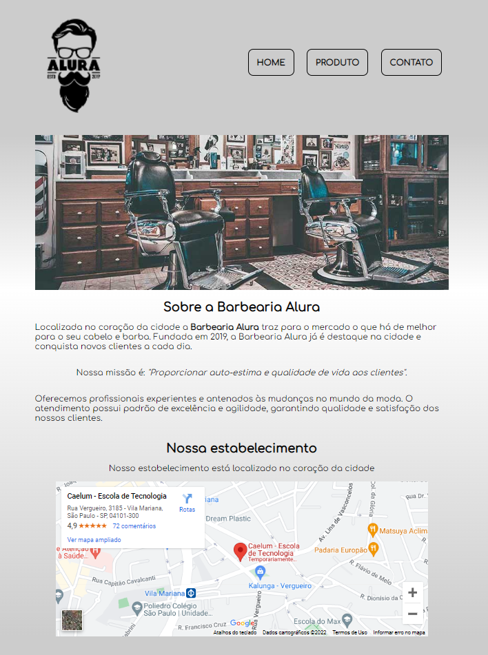
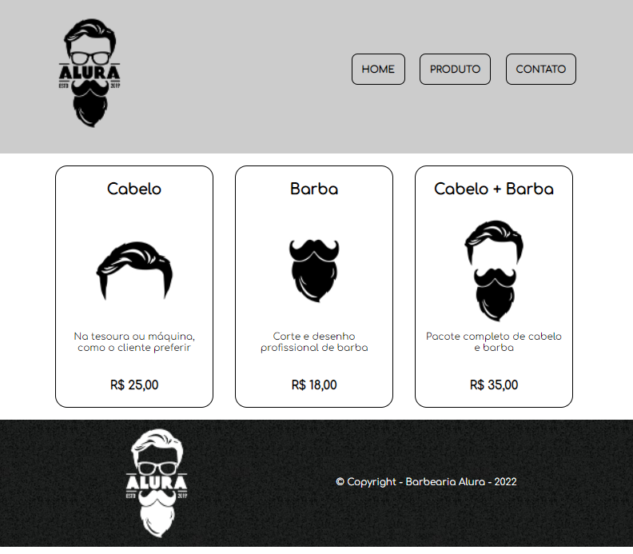
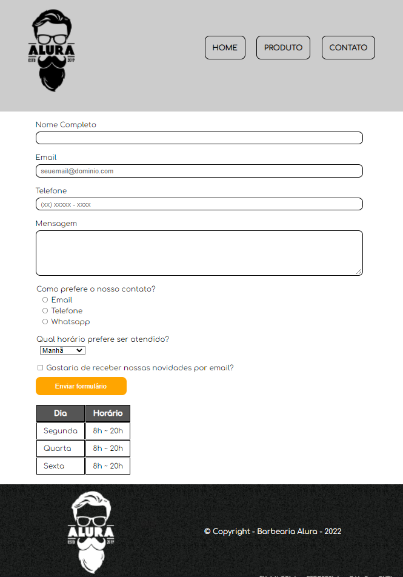
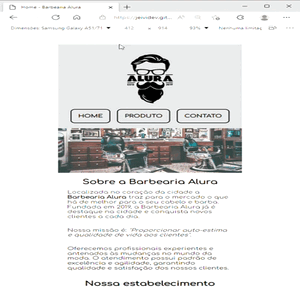

# Clone - Barbearia Alura

## 🗒 Descrição do projeto
Recriando o projeto do curso *HTML5 e CSS3* na Formação: **Front-end** da [Alura](https://www.alura.com.br/).

O projeto foi refeito utilizado o método de **Mobile First**, conhecimento adquiro no curso *Layout Responsivos - **Alura***
## 🌐 Página:
Link: [https://jeividev.github.io/Clone_Barbearia_Alura/](https://jeividev.github.io/Clone_Barbearia_Alura/)
## 🛠 Tecnologias usadas
- [HTML](https://developer.mozilla.org/en-US/docs/Web/HTML)
- [CSS](https://developer.mozilla.org/en-US/docs/Web/CSS)
 
## 📷  Imagem do Projeto
### Telas:

#### Home:

#### Produtos:

#### Contato:

## 📹  Vídeo do Projeto
### Responsividade:

### Páginas no Mobile:

